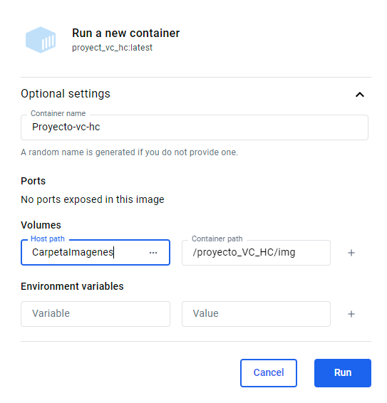
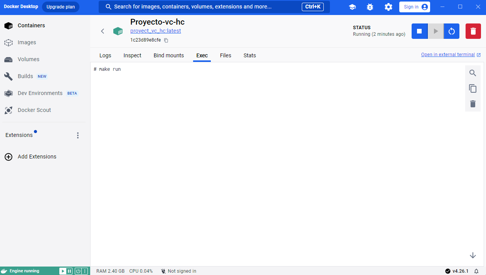

# Proyecto-VC-HC: 
* Autores: 
  * Raimon Mejías Hernández (alu0101390161@ull.edu.es)
  * Evian Concepción Peña(alu0101395548@ull.edu.es)
  * Saul Sosa Díaz(alu0101404141@ull.edu.es)
  * Francisco Marqués Armas (alu0101438412@ull.edu.es)
  * Eva Peso Adán (alu0101398037@ull.edu.es)

## Resumen
Este repositorio contiene la implementación de la transformación polinomial del problema del recubrimiento de vértices (vertex-cover) al problema del circuito hamiltoniano. El código está desarrollado en varios lenguajes de programación. La sección encargada de la transformación polinomial está específicamente escrita en C++. Posteriormente, se ejecuta un script en Julia que no solo genera una imagen visual del grafo resultante, sino que también ofrece la posibilidad de resolver el problema del camino hamiltoniano asociado.

## Dependencias:
Para asegurar el correcto funcionamiento del programa, es esencial contar con las siguientes librerías:
* [json](https://github.com/nlohmann/json): Esta es una librería necesaria para el manejo de archivos JSON en C++. Puede instalarse usando el siguiente comando en BASH:
```BASH
sudo apt install nlohmann-json3-dev
```

Además, para ejecutar completamente el programa y generar imágenes, es necesario tener instalado Julia. Sin embargo, si no se requiere la generación de imágenes, la instalación de Julia no es imprescindible.

En el caso de preferir no instalar Julia, existen alternativas como:

1. Utilizar Docker para crear un entorno donde todas las dependencias ya están instaladas.
En caso de que no quiera instalarlo tenemos varias opciones como utilizar docker para crear un entorno donde ya está todo instalado. 

2. Enfocarse únicamente en la parte escrita en C++. En este caso, para manejar las dependencias, se puede usar el siguiente comando en BASH al ejecutar make:
```BASH
make dependencies
```

## Ejecución 
Para la ejecución de la parte única de C++ se puede utilizar el comando:
```BASH
make run
```
Si se quisiera utilizar [Docker](https://www.docker.com/), para tener acceso a todas las funcionalidades del programa, lo primero que se debe hacer es instalarlo. 
Docker funciona como un entorno de ejecución, similar a una máquina virtual, pero con características específicas que facilitan la práctica de desarrollo de software. 
1. Descargar e instala Docker desde este [enlace](https://www.docker.com/products/docker-desktop/).  
   
2. Desde el directorio raíz de la práctica debemos crear la imagen para ello utilizamos el comando
    ```BASH
    docker build -t ESPECIFICAR_NOMBRE_IMAGEN .
    ```
3. Iniciamos Docker-desktop
   
4. Vamos al apartado del programa images. Y le damos a ejecutar.
     

5. Ejecutamos la imagen y nos creará un contenedor. 
    * Debemos específicar el nombre del contenedor.
    * Debemos montar el directorio donde se guardarán las fotos de los grafos resultantes. 
    * Debemos introducir en el container path lo siguiente: ```/proyecto_VC_HC/img```
     

6. Avanzamos al apartado exec e introducimos:
    ```BASH
    make run
    ```
      

    El programa se deberá ejecutar con normalidad.  
    
7. Opcionalmente podemos eliminar el container y la imgen una vez el programa haya finalizado.

## Estructura de directorios
```
  .
  ├── src            # Código fuente
  ├── inc            # Librerías para el funcionamiento del código fuente.
  ├── graphInstances # Grafos de entrada para el programa.
  ├── graphResults   # Grafos resultantes del programa.
  ├── doc            # Contiene el informe de la práctica.
  ├── img            # Imágenes de los grafos resultantes. 
  └── bin            # Incluye los ficheros ejecutables del programa.
```

## Referencias:
* [JSON](https://github.com/nlohmann/json): Librería para manejar ficheros en JSON en C++.
* [Docker](https://www.docker.com/): Para crear entonos de software.
* [Descarga Docker](https://www.docker.com/products/docker-desktop/): Descarga de Docker.
